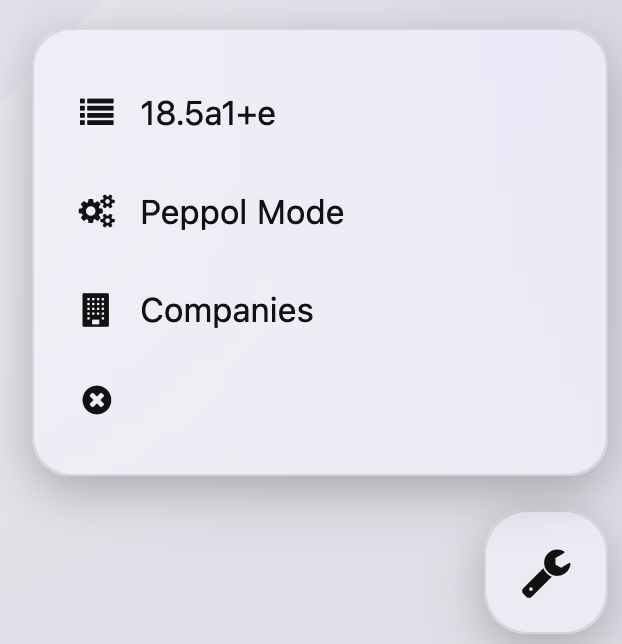

<h1 align="center">Peppol Toolbox</h1>

  

  

---

## Install

1) Go to [Releases](https://github.com/antonrom1/peppol-toolbox/releases/)
2) Download the assets for your browser.

Chromium
- Get `peppol-toolbox-<version>.zip`
- Unzip it
- Open `chrome://extensions`
- Turn on Developer mode
- Click Load unpacked, then select the unzipped `extension/` folder

Firefox
- Get the signed `peppol-toolbox-<version>.xpi`.  
- Open it with Firefox (or `about:addons` > gear > Install Add-on From File)
